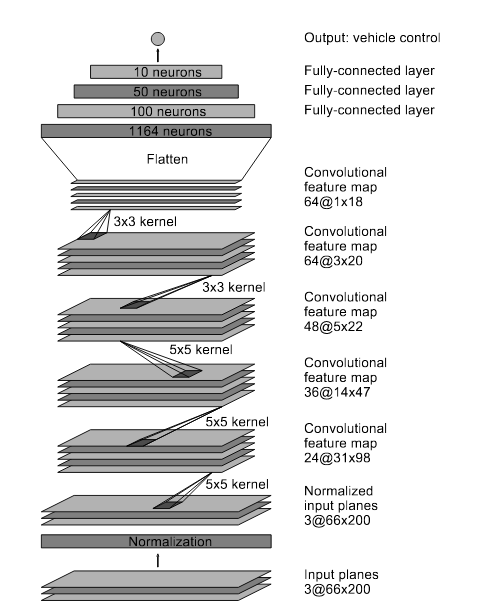

# **Behavioral Cloning** 

---

**Behavioral Cloning Project**

The goal of this project is to create a deep neural net with convolutional net layers to clone my driving behavior within a simulator. This document is the writeup for lessons learned during the project.

## Getting started

Before getting too deep into the project, I created `simple_test.py`. The goal of this file was to test the entire pipeline of

1) Getting the training data loaded
2) Creating a keras model
3) Training the keras model
4) Using the model to control the autonomous car

To do this, simple_test.py creates a simple dense neural network - no convolutional nets or anything else special. The goal here is to not create a good autonomous driver - in fact, it didn't create a good driver at all. It was to ensure that each step worked and I could create a model that would control the simulator car autonomously. This limits debugging time later to trying to figure out the simulator/data input instead of focussing my time on choosing an architecutre and training it.

## Model Architecture and Training Strategy

### NVidia Architecture
In `model.py`, I implemented the NVidia self driving car architecture

The whitepaper on the architecture (and source for above architecture image) can be found [here](https://arxiv.org/pdf/1704.07911.pdf).

### Changes to the NVidia Architecture
The paper did not specify which activation layer it used - I used RELU (rectified linear unit). This is a popular activation unit and considered a great starting point - I never encountered any reason to change from this.

I also added dropout after each convolutional layer to combat overfitting - this is to be discussed later.

### Attempts to reduce overfitting in the models
Despite capturing a few thousand resulting images (especially after cutting data that was too straight to prevent a bias (also to be discussed later)) for training, I had no where near enough data to train a full CNN for many epochs - I would overfit very quickly.

As such I limited training to 3 epochs. Additional epochs seemed to cause overfitting very quickly - even 5 epochs resulted in this and worse performance overall.

I employed various strategies in data collection for overfitting battling (not just a straight run of the base course), as well as some data augmentation - this is discussed later.

I also added the aforementioned dropout layers between convolutional layers. I set the dropout percentage to about 30% (after playing with a few percentages). A higher dropout didn't make much sense with the low amount of epochs I was running, but I still needed some dropout to prevent certain convolutional features biasing too strong a reaction within the network.

### 3. Model parameter tuning

The adam optimizer was used - learning rate was not manually adjusted.

Dropout rate was tested at first at 70% and down turned from there. I had discovered prior that a shorter amount of epochs were better (discussed earlier). Eventually 30% seemed to reduce the overfitting without losing performance.

## 4. Model Training and Data Gathering strategies

### Garbage in, garbage out

I found that the keyboard controls for the car was garbage input. When driving with the keyboard, you would merely tap the button to adjust the angle a little bit, resulting in a data that would only occasionally actually have turn data. Your adjustments with keyboard would be inconsistent microadjustments.

I found a mouse produced far better results, allowing me to do controlled and long turns holding a steering angle that made sense for the turn.

### How I organized the data

Originally, I was collecting all data into one folder. This became problematic later as I wanted to employ different strategies on *what* data I would use for training.

I redid my training, this time saving what I was doing in aptly named folders. I then included the folders to train on in an array in model.py, having it piece together a larger training set from the smaller sets.

This way, I could pick and choose as I wished training sets that focussed on, but not limited to:

1. The 1st course forwards only
2. The 1st course in reverse
3. Problematic turns would get their own training sets
4. The second course
5. Various recovery positions

The first two (and fourth) are self explanatory. The problematic turns would be individual data sets (much smaller) adding additional data on how to react to problematic turns - the 1st course had two such turns towards the middle of the course.

Problematic positions is where I would put the car facing the wrong direction - sideways, or towards the lane - and start the recording as I immediately correct the back to the center of the lane.

### Straight data biases

There was a significant problem - the car had a strong bias to go straight, simply because of the amount of data that said to go straight. I randomly removed 80% of the straight data (approximately the amount needed to even out the data samples) of any data that had below a 0.9 absolute angle.

### Generator

The generator would pull a batch of 24 samples. It would end up generating 6 images/training data points per sample, resulting in an actual batch size of 144.

Each sample would grab the center, left, and right camera images. The center camera image angle went unadjusted - the left and right camera images were added to the training set with an adjustable correction to its angle - this acted as faking extra training data from the center camera.

All three were then horizontally flipped, and the steering angle adjusted to its flipped equivalent as well, and added to the data set. This data augmentation double my data input.

## Results

The vehicle can be seen completing a run in run1.mp4. While it comes close to hitting a corner on the tighest right on the course, it still avoids the curb completely and quickly moves back into the center of the lane.

## Additional thoughts during training

This showed the effectiveness of the CNN network - without much data, we couldn't train it much, but even just 3 epochs of training resulted in a useable model.
